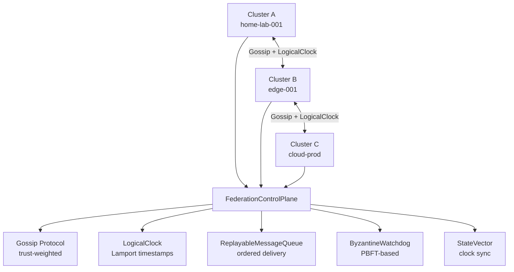

# atom-federation

> Cross-cluster federation layer — trust-weighted gossip, logical clocks и deterministic message ordering.

[](https://go.dev)
[](LICENSE)

## Overview

**atom-federation** — слой объединения нескольких ATOM-кластеров в единую федерацию с сохранением детерминизма и воспроизводимости.

## Architecture



## Core Components

### LogicalClock (Lamport-style)

```go
// Lamport logical clock — total ordering without physical time.
// Guarantees: if A happened-before B, then LogicalClock(A) < LogicalClock(B).
// But: LogicalClock(A) < LogicalClock(B) does NOT imply A happened-before B.
type LogicalClock struct {
    mu     sync.Mutex
    Tick   uint64
    NodeID string
}

func (c *LogicalClock) Increment() uint64 {
    c.mu.Lock()
    defer c.mu.Unlock()
    c.Tick++
    return c.Tick
}

func (c *LogicalClock) Sync(remoteTick uint64) {
    c.mu.Lock()
    defer c.mu.Unlock()
    if remoteTick > c.Tick {
        c.Tick = remoteTick
    }
    c.Tick++
}
```

### ReplayableMessageQueue

```go
// Deterministic message queue — same delivery order on replay.
// Fanout order: hash(nodeID + tick) → deterministic node ordering per tick.
type ReplayableMessageQueue struct {
    mu      sync.Mutex
    pending []Message
    history []Message // append-only, used for replay
}

func (q *ReplayableMessageQueue) Enqueue(msg Message) {
    q.mu.Lock()
    defer q.mu.Unlock()
    msg.OrderKey = q.computeOrderKey(msg)
    q.pending = append(q.pending, msg)
    q.history = append(q.history, msg)
}

func (q *ReplayableMessageQueue) computeOrderKey(msg Message) string {
    // Deterministic: same inputs → same output
    h := sha256.Sum256([]byte(fmt.Sprintf("%s-%d-%s", msg.SourceNode, msg.Tick, msg.ID)))
    return fmt.Sprintf("%016x-%s", msg.Tick, hex.EncodeToString(h[:8]))
}
```

### GossipProtocol (trust-weighted)

```go
// Trust-weighted gossip: peers with higher trust score spread faster.
// Trust computed from: successful interactions, uptime, replay match rate.
type GossipProtocol struct {
    NodeID       string
    Peers        map[string]*Peer
    TrustScores  map[string]float64
    MessageQueue *ReplayableMessageQueue
}

func (g *GossipProtocol) Spread(msg Message) {
    // Sort peers by trust score descending
    peers := g.sortedByTrust()

    // Fanout: top-k trusted peers get the message first
    for _, peer := range peers[:g.config.FanoutK] {
        go g.sendToPeer(peer, msg)
    }
}
```

### ByzantineWatchdog

```go
// PBFT-based byzantine fault detector.
// ViewChange triggered when > 1/3 nodes report suspicious behavior.
type ByzantineWatchdog struct {
    NodeID    string
    Threshold int // f = floor((n-1)/3)
    Reports   map[string][]SuspicionReport
}

func (w *ByzantineWatchdog) Report(nodeID, suspiciousNodeID string, reason string) {
    w.Reports[nodeID] = append(w.Reports[nodeID], SuspicionReport{
        NodeID: suspiciousNodeID,
        Reason: reason,
        Tick:   w.clock.CurrentTick(),
    })

    if len(w.Reports[nodeID]) > w.Threshold {
        w.TriggerViewChange()
    }
}
```

## Quick Start

```bash
git clone https://github.com/mahaasur13-sys/atom-federation.git
cd atom-federation

make build
make test

# Run federation node
CLUSTER_ID=home-lab-001 PEERS=edge-001:9001,cloud-prod:9001 make run
```

## Project Layout

```
atom-federation/
├── cmd/federation/      # Entry point
├── pkg/
│   ├── gossip/          # GossipProtocol
│   ├── clock/           # LogicalClock
│   ├── queue/           # ReplayableMessageQueue
│   ├── byzantine/       # ByzantineWatchdog
│   └── statevector/     # StateVector sync
├── config/
├── Makefile
└── go.mod
```

## Determinism Theorem

Federation preserves determinism because:
1. `LogicalClock` provides total ordering without wall-clock time
2. `ReplayableMessageQueue` delivers same order on replay (hash-based fanout)
3. `DeterministicFanoutOrder`: `hash(nodeID + tick)` — no ties possible

## License

MIT © mahaasur13-sys
